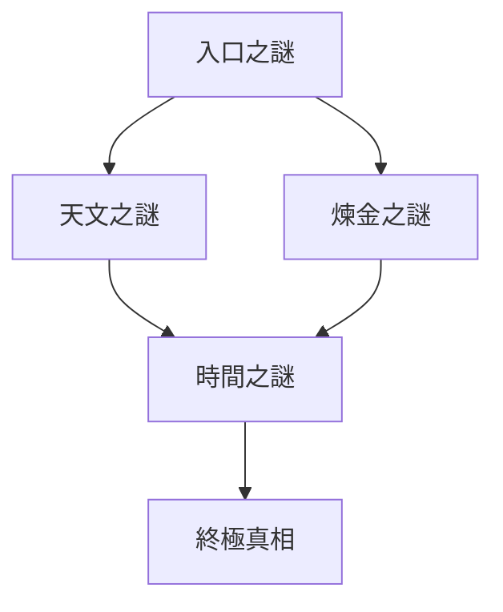

# 古老圖書館之謎

一個複雜的解謎遊戲，展示了文字冒險引擎的高級功能和極限。

## 遊戲概述

在這座神秘的古老圖書館中，玩家需要通過解開一系列相互關聯的謎題來揭開圖書館的秘密。遊戲融合了天文學、煉金術和時間規律等元素，打造出一個深度的解謎體驗。

## 核心謎題系統

### 1. 天文觀測之謎
- 複雜的星座排列系統
- 天體運動週期計算
- 古老天文儀器操作
- 要求精確的觀測和調整

### 2. 煉金術轉化之謎
- 元素組合系統
- 物質轉化規律
- 配方解析
- 實驗過程控制

### 3. 時間規律之謎
- 時序謎題
- 因果關係
- 時間週期
- 多重時間線

## 遊戲機制深度

### 1. 多層次解謎系統
```yaml
puzzle_depth:
  layer1: "基礎謎題" # 單一場景內的獨立謎題
  layer2: "關聯謎題" # 需要跨場景收集線索
  layer3: "綜合謎題" # 需要組合多個謎題的解答
  layer4: "終極謎題" # 需要理解所有前序謎題的深層含義
```

### 2. 知識系統
```yaml
knowledge_types:
  - astronomy: "天文知識"
  - alchemy: "煉金術知識"
  - temporal: "時間規律"
  - history: "圖書館歷史"
```

### 3. NPC互動系統
- 複雜的對話樹
- 基於信任度的知識解鎖
- 動態提示系統
- 記憶系統影響對話

## 謎題相依性



## 開發者功能展示

### 1. 事件系統
```python
# 複雜事件鏈示例
event_chain = {
    "trigger": "star_alignment",
    "conditions": ["has_knowledge", "has_tool"],
    "consequences": [
        "activate_mechanism",
        "reveal_secret",
        "update_npc_memory"
    ]
}
```

### 2. 狀態追踪
```python
# 深度狀態管理
state_tracker = {
    "puzzle_states": {},
    "player_knowledge": {},
    "npc_relationships": {},
    "time_variables": {}
}
```

### 3. 記憶系統
```python
# NPC記憶處理
memory_system = {
    "short_term": {"capacity": 10, "decay_rate": 0.1},
    "long_term": {"importance_threshold": 0.7},
    "relationships": {"trust_impact": 0.3}
}
```

## 技術極限展示

1. **狀態複雜度**
   - 最大並行事件數: 50
   - 動態狀態變量: 100+
   - 記憶節點數: 1000+

2. **互動深度**
   - 對話樹深度: 10層
   - 條件分支: 20+/節點
   - 結果變化: 100+種

3. **謎題複雜度**
   - 最大步驟數: 15
   - 相依關係: 5層
   - 組合可能: 1000+

## 開發指南

### 1. 添加新謎題
```yaml
new_puzzle:
  id: "unique_id"
  type: "combination"
  dependencies: []
  validation: "custom_validator"
  rewards:
    - type: "item"
      id: "new_item"
```

### 2. 擴展對話系統
```yaml
dialogue_extension:
  triggers:
    - condition: "puzzle_solved"
      response: "dynamic_response"
  memory_impact:
    importance: 0.8
    categories: ["puzzle", "relationship"]
```

### 3. 自定義驗證器
```python
def custom_validator(puzzle_state, player_input):
    """
    自定義謎題驗證邏輯
    """
    return {
        "valid": bool,
        "feedback": str,
        "side_effects": []
    }
```

## 性能優化建議

1. **記憶系統**
   - 使用重要性閾值過濾
   - 定期清理過期記憶
   - 優化檢索算法

2. **狀態管理**
   - 使用狀態快照
   - 增量更新
   - 懶加載機制

3. **事件處理**
   - 事件優先級隊列
   - 批處理機制
   - 異步處理

## 除錯工具

1. **狀態檢視器**
   ```bash
   python debug_tools.py --inspect-state
   ```

2. **謎題測試器**
   ```bash
   python puzzle_tester.py --puzzle-id <id> --auto-solve
   ```

3. **記憶分析器**
   ```bash
   python memory_analyzer.py --npc <npc_id> --depth all
   ```

## 已知限制

1. **系統限制**
   - 最大場景數: 50
   - 最大NPC數: 20
   - 最大並行謎題: 10

2. **性能限制**
   - 記憶檢索深度: 100
   - 最大對話歷史: 1000
   - 最大狀態變量: 500

3. **互動限制**
   - 組合物品上限: 5
   - 條件檢查深度: 8
   - 事件鏈長度: 20

## 最佳實踐

1. **謎題設計**
   - 確保邏輯性
   - 提供足夠線索
   - 漸進式難度

2. **內存管理**
   - 定期清理無用狀態
   - 優化記憶存儲
   - 控制事件堆積

3. **錯誤處理**
   - 優雅的失敗處理
   - 狀態回滾機制
   - 玩家反饋機制

本遊戲展示了文字冒險引擎在處理複雜解謎遊戲時的能力。通過合理的架構設計和優化，引擎能夠支持深度的遊戲玩法，同時保持良好的性能和可維護性。